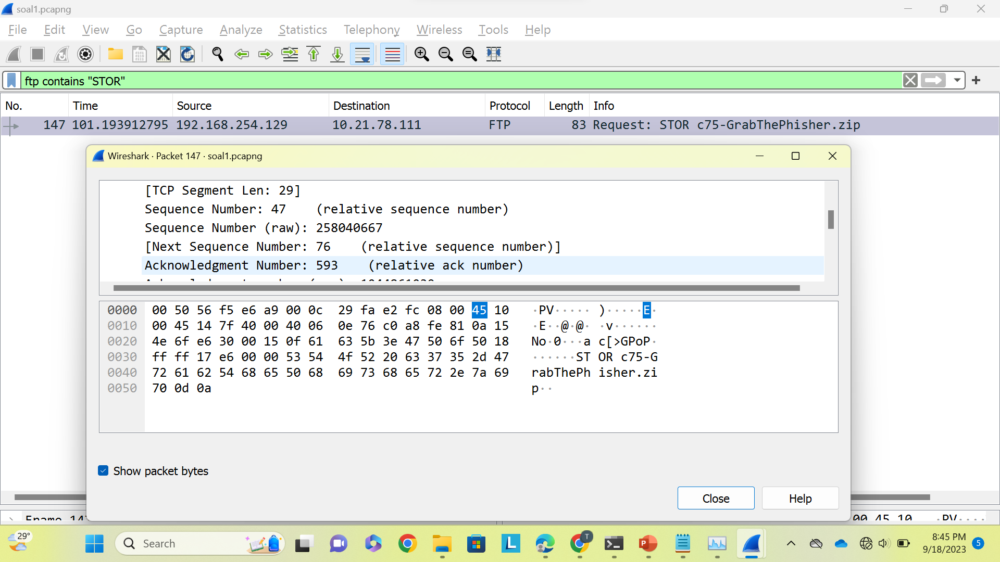
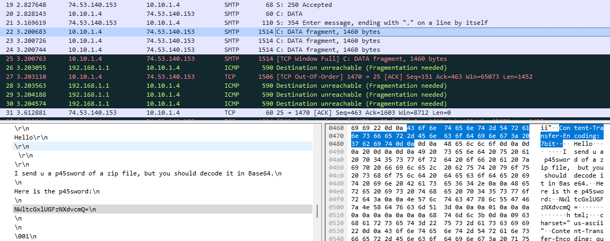
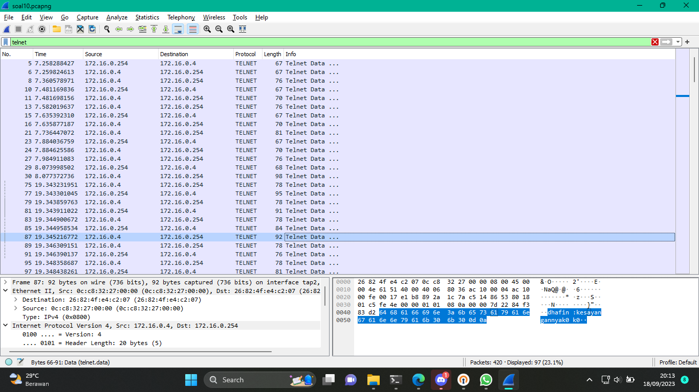

# Jarkom-Modul-1-F10-2023
Laporan resmi praktikum modul 1 wireshark &amp; crimping mata kuliah jaringan komputer
Kelompok: F10
Nama anggota 1: Radhiyan M Hisan
NRP anggota 1: 5025211166
Nama anggota 2: Thoriq Afif Habibi
NRP anggota 2: 5025211154

## 1. User melakukan berbagai aktivitas dengan menggunakan protokol FTP. Salah satunya adalah mengunggah suatu file.
Pada FTP, aktivitas mengunggah dapat dilakukan dengan menggunakan perintah STOR sehingga pasti akan ada paket request STOR dari client pada PCAP yang telah diberikan. Paket dapat dicari dengan memberi display filter “ftp contains "STOR"”. Dari gambar tangkap layar berikut, didapatkan paket yang menunjukkan aktivitas mengunggah berada di paket ke 147. 
 
Selanjutnya, kita dapat mencari respon yang diberikan oleh server dengan mengikuti tcp stream paket di atas. Di paket 149, terlihat terdapat respon yang diberikan sebagai berikut:
  
Dari tangkap layar di atas, maka didapat seuqence dan acknowledge number dari paket tersebut sebagai berikut:
- Berapakah sequence number (raw) pada _packet_ yang menunjukkan aktivitas tersebut? **258040667** 
- Berapakah acknowledge number (raw) pada _packet_ yang menunjukkan aktivitas tersebut? **1044861039** 
- Berapakah sequence number (raw) pada _packet_ yang menunjukkan response dari aktivitas tersebut? **1044861039** 
- Berapakah acknowledge number (raw) pada _packet_ yang menunjukkan response dari aktivitas tersebut? **258040696**

## 2. Sebutkan web server yang digunakan pada portal praktikum Jaringan Komputer!
Melakukan display filter dengan kueri http. Kemudian mem-follow http stream. Informasi web server yang digunakan tertera pada kolom Server. 

## 3. Dapin sedang belajar analisis jaringan. Bantulah Dapin untuk mengerjakan soal berikut:
Pada soal 3, diperlukan paket dengan IP source maupun destination 239.255.255.250 dan port 3702. Paket ini bisa dicari dengan membuka file -> open. Lalu, pilih file pcap yang telah diberikan dan masukkan read filter dengan sintaks "(ip.src == 239.255.255.250 || ip.dst == 239.255.255.250) && (tcp.port == 3702 || udp.por t== 3702)". Ketika dibuka akan menampilkan paket-paket yang telah difilter seperti berikut 
Open dan filter file: 
 
Hasil: 
  
Dari hasil, dapat dilihat jumlah paket dan protokol yang digunakan oleh paket-paket tersebut.
- Berapa banyak paket yang tercapture dengan IP source maupun destination address adalah 239.255.255.250 dengan port 3702? **21** 
- Protokol layer transport apa yang digunakan? **UDP**

## 4. Berapa nilai checksum yang didapat dari header pada paket nomor 130?
Mengecek paket yang dimaksud. Informasi nilai checksum ada di bawah dropdown layer transport, UDP. 

## 5. Elshe menemukan suatu file packet capture yang menarik. Bantulah Elshe untuk menganalisis file packet capture tersebut.
Mengecek satu-satu dari _packet_ yang tertangkap akan data yang dapat dibaca. Ditemukan email yang isinya dapat dibaca di _packet_ nomor 22. Email berisi password terenkripsi beserta instruksi memecahkannya, yaitu menggunakan Base64. 
 
Menggunakan decoder Base64 daring. Didapatkan password untuk membuka file zip yang terkunci. 
 
Isi dari file zip yang terkunci adalah alamat pertanyaan-pertanyaan untuk dijawab. 
  
a. Berapa banyak _packet_ yang berhasil di capture dari file pcap tersebut? **60** 
b. Port berapakah pada server yang digunakan untuk service SMTP? **25** 
c. Dari semua alamat IP yang tercapture, IP berapakah yang merupakan public IP? **74.53.140.153** (alamat IP selain dari IP local kita)

## 6. Seorang anak bernama Udin Berteman dengan SlameT yang merupakan seorang penggemar film detektif. sebagai teman yang baik, Ia selalu mengajak slamet untuk bermain valoranT bersama. suatu malam, terjadi sebuah hal yang tak terdUga. ketika udin mereka membuka game tersebut, laptop udin menunjukkan sebuah field text dan Sebuah kode Invalid bertuliskan "server SOURCE ADDRESS 7812 is invalid". ketika ditelusuri di google, hasil pencarian hanya menampilkan a1 e5 u21. jiwa detektif slamet pun bergejolak. bantulah udin dan slamet untuk menemukan solusi kode error tersebut.
Pada soal, terdapat 3 hal yang dapat diambil sebagai premis untuk mencari jawaban dari permasalahan ini.
1. Terdapat beberapa kata yang memuat huruf kapital, yaitu "Seorang", "Udin", "Berteman", "SlameT", "Ia", "valoranT", "terdUga", "Sebuah", dan "Invalid". Kesembilan huruf besar pada 8 kata tersebut jika disatukan akan membentuk kata "SUBSTITUSI".
2. kode invalid "server SOURCE ADDRESS 7812 is invalid". Pada kalimat ini, hanya tulisan "SOURCE ADDRESS 7812" yang berupa huruf kapital. Hal ini menunjukkan bahwa tulisan tersebut memiliki pesan khusus.
3. "hasil pencarian hanya menampilkan a1 e5 u21", hasil pencarian ini juga memiliki makna khusus. Dapat dilihat bahwa a1 e5 u21 merupakan pasangan huruf dengan angka urutan huruf tersebut dalam susunan abjad.
Dari premis pertama dan ketiga, bisa diperkirakan bahwa soal ini meminta kita untuk melakukan substitusi pada suatu angka atau huruf sesuai dengan pasangan huruf dan urutan hurufnya. Pada premis kedua, "SOURCE ADDRESS" dapat dikatakan sebagai ip address dari pengirim di paket tersebut dan "7812" dapat dapat dikatakan sebagai nomor paket. Ketika ditelusuri, paket ke-7812 tersebut memiliki ip address source yaitu "104.18.14.101". Karena yang akan disubtitusi berupa angka, maka kita perlu mengubah angka tersebut ke bentuk huruf. Angka-angka pada ip tersebut dapat dipisah-pisah menjadi "10 4 18 14 10 1" dan dapat disubtitusi menjadi "JDRNJA". 

## 7. Berapa jumlah packet yang menuju IP 184.87.193.88?
Paket yang sesuai dapat dicari dengan membuka file dengan read filter `ip.dst==184.87.193.88` seperti berikut: 
 
Hasil paket yang didapat adalah sebagai berikut: 
 
Dari hasil tersebut, dapat dilihat bahwa terdapat **6** paket yang sesuai ketentuan.

## 8. Berikan kueri filter sehingga wireshark hanya mengambil semua protokol paket yang menuju port 80! (Jika terdapat lebih dari 1 port, maka urutkan sesuai dengan abjad)
`tcp.dstport == 80 || udp.dstport == 80` 

## 9. Berikan kueri filter sehingga wireshark hanya mengambil paket yang berasal dari alamat 10.51.40.1 tetapi tidak menuju ke alamat 10.39.55.34!
`ip.src == 10.51.40.1 && ip.dst != 10.39.53.34` 

## 10. Sebutkan kredensial yang benar ketika user mencoba login menggunakan Telnet
Mencoba-coba kombinasi yang tersedia dengan format username:password yang merupakan format kredensial telnet. 
